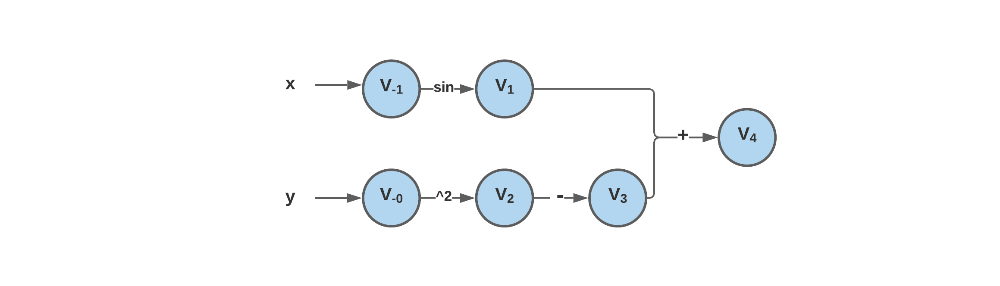
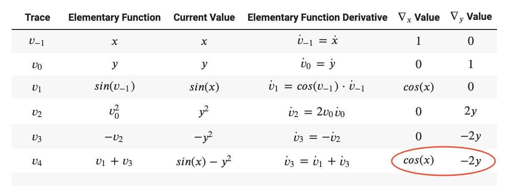
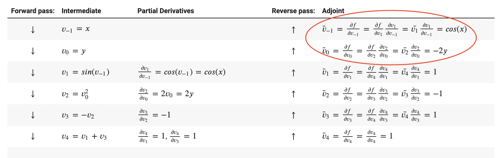

# Documentation

## Introduction

This is a package that offers the feature of automatic differentiation.

Automatic differentiation is useful in many fields, including but not limit to:

- Calculation of derivatives when using some iterative methods to solve linear systems
- Calculation of the gradient of an objective function in optimization
- Calculation of derivatives/gradients which are parts of some numerical methods to solve differential equation systems

Automatic differentiation is better than other differencing methods like finite-difference because it is much cheaper. Finite differences are expensive, since you need to do a forward pass for each derivative. Automatic differentiation is both efficient (linear in the cost of computing the value) and numerically stable. Traditional methods of differentiation such as symbolic differentiation do not scale well to vector functions with multiple variable inputs, which are widely used to solve real world problems.

The functions and features in this package can evaluate derivatives/gradients of specified expressions and free users from manual calculation.


## Background

For a function, even a complicated one, the computer is able to compute its derivatives by breaking it down into smaller parts, applying chain rule to the elementary operations, and calculate intermerdiate results at each step.

In the graph structure of such calculation, each node is an intermediate result, and each arrow is an elementary operation. An elementary operation are such as addition, subtraction, multiplication, division, or taking exponential, log, sine, cosine, etc. In short, AD represent a function as a composition of elementary functions through elemtary operations by a sequence of intermediate values.

An example is provided below.


<p align="center">
</a>
</p>

The computation graph for this function is shown below:



### Forward Mode

In forward mode, AD starts from the inputs and work towards the outputs, evaluating the value of each intermediate value along with its derivative with respect to a fixed input variable using the chain rule.
<p align="center">
</a>
</p>
In the example above, a trace table for forward AD would look like the following to compute and store intermediate values and derivatives:

<p align="center">


</p>

### Reverse Mode
In reverse mode, AD starts from the inputs to do a forward pass to calculate all the intermediate values, and then starts from the outputs to do a reverse pass to compute the derivatives of the function with respect to the intermediate values backwards using the chain rule.
<p align="center">
</a>
</p>
<p align="center">


</p>

## How to use

### Installation

Install the AutoDiffRunTimeError package using `pip` command like below:

```
pip install -i https://test.pypi.org/simple/ AutoDiffRunTimeError==0.0.1
```

You are recommended to use the package under Python version 3.6.2 or later. 

### Demo

#### Import the AutoDiff library

```
import AutoDiff as ad
```
#### Automatic Differentiation with auto_diff() function

The `auto_diff()` function takes 4 parameters
- functions - str (functions written as a string) / list (a list of functions written as strings) / lambda function (returning a single function or a list of functions), the function or list of functions for which you would like to get derivatives
- var_dict - dictionary, specify the names and values for all variables in input functions
- target - list, list of string specifying the name of your target variables to calculate the derivative, default to None, which will return derivative for all variables
- mode - str, "forward" or "reverse", specify the mode of automatic differentiation, default as "forward"

Reminder: Don't write #comment on the same line when defining function for which derivative will be evaluated at!  

Notice: The method does not support power operation when the base is negative and the power is a value between -1 and 1, since the edge cases can be very complex. For instance, a negative value to the power of one half is invalid, but a negative value to the power of one third is okay. 

##### Scalar Function with Scalar Input:

```
var_dict = {"x1": np.pi}
function1 = "sin(x1) + cos(x1)"
der = ad.auto_diff(functions=function1, var_dict=var_dict, target=["x1"], mode="reverse")
```
Output:
```
Functions: sin(x1) + cos(x1)
Variables: {'x1': 3.141592653589793}
------------------------------
Jacobian:
 [[-1.0000000000000002]]
 ```

The function will print the function, input variable and result (derivative / partial derivative / gradient / jacobian depending on inputs) automatically, and it will also return the result as a list.

```
print(der)
```
Output:
```
[[-1.0000000000000002]]
```

##### Scalar Function with Vector Input:
```
var_dict = {"x1": np.pi / 2, "x2": 1, "x3": 0}
function1 = "sin(x1) + cos(x2) - exp(x3)"

der1 = ad.auto_diff(function1, var_dict, ["x1"], mode="reverse")
der2 = ad.auto_diff(function1, var_dict, ["x2"], mode="reverse")
der3 = ad.auto_diff(function1, var_dict, ["x3"], mode="reverse")
```
Output:
```
Functions: ['sin(x1) + cos(x2) - exp(x3)']
Variables: {'x1': 1.5707963267948966, 'x2': 1, 'x3': 0}
------------------------------
partial derivative with respect to x1: [6.123233995736766e-17]

Functions: ['sin(x1) + cos(x2) - exp(x3)']
Variables: {'x1': 1.5707963267948966, 'x2': 1, 'x3': 0}
------------------------------
partial derivative with respect to x2: [-0.8414709848078965]

Functions: ['sin(x1) + cos(x2) - exp(x3)']
Variables: {'x1': 1.5707963267948966, 'x2': 1, 'x3': 0}
------------------------------
partial derivative with respect to x3: [-1.0]
```

##### Vector Function with Scalar Input
```
var_dict = {"x1": np.pi / 2, "x2": 1, "x3": 0}
function1 = ["tanh(x1) + cosh(x2 * 3) - sec(x3)", "x1 / x2 * cos(x3)", "sin(x1 / 2) + x2 * x3"]

gradient = ad.auto_diff(function1, var_dict, ["x1"], mode="reverse")
```
Output:
```
Functions: ['tanh(x1) + cosh(x2 * 3) - sec(x3)', 'x1 / x2 * cos(x3)', 'sin(x1 / 2) + x2 * x3']
Variables: {'x1': 1.5707963267948966, 'x2': 1, 'x3': 0}
------------------------------
gradient with respect to x1: [0.15883159318006335, 1.0, 0.3535533905932738]
```

##### Vector Function with Vector Input:
```
var_dict = {"x1": np.pi / 2, "x2": 1, "x3": 0}
functions = ["tanh(x1) + cosh(x2 * 3) - sec(x3)", "x1 / x2 * cos(x3)", "sin(x1 / 2) + x2 * x3"]

jacobian = ad.auto_diff(functions, var_dict, ["x1", "x2", "x3"], mode="forward")
```
Output:
```
Functions: ['tanh(x1) + cosh(x2 * 3) - sec(x3)', 'x1 / x2 * cos(x3)', 'sin(x1 / 2) + x2 * x3']
Variables: {'x1': 1.5707963267948966, 'x2': 1, 'x3': 0}
------------------------------
Jacobian:
 [[ 0.15883159 30.05362478  0.        ]
 [ 1.         -1.57079633  0.        ]
 [ 0.35355339  0.          1.        ]]
 ```

#### Lambda function input using `auto_diff()` function

In our final submission, we added lambda function input as one of our new features. Using `auto_diff()` for lambda function is the same as string function input.
```
var_dict = {"x1": np.pi, "x2": 2, "x3": 5}

lambda_vec_func = lambda x1, x2: [cos(x1 / 2) + x2 * log(x3), sin(x1) + exp(x2) - x3 ** 4]

jacobian = ad.auto_diff(functions=lambda_vec_func, var_dict=var_dict, target=["x1", "x2", "x3"], mode="reverse")
```
Output:
```
Functions: ['cos(x1 / 2) + x2 * log(x3)', 'sin(x1) + exp(x2) - x3 ** 4']
Variables: {'x1': 3.141592653589793, 'x2': 2, 'x3': 5}
------------------------------
Jacobian:
 [[-0.5, 1.6094379124341003, 0.4], [-1.0, 7.38905609893065, -500.0]]
 ```

#### ForwardNode Class

While it is not necessary since we provided the wrap function `auto_diff()`, user can also choose to create their own ForwardNode variables and define the functions using these ForwardNode variables. This would require importing additional modules from the package.
```
import AutoDiff as ad
from AutoDiff import ForwardNode
from AutoDiff import ReverseNode
from AutoDiff.utils import *
```
Create a ForwardNode object

```
x1 = ForwardNode(value=5.0, trace=[0, 0, 1], var=["x1", "x2", "x3"])
x2 = ForwardNode(value=10.0, trace=[0, 0, 1], var=["x1", "x2", "x3"])
x3 = ForwardNode(value=8.5, trace=[0, 0, 1], var=["x1", "x2", "x3"])
```
Elementary operations with ForwardNode objects is the same as ordinary Python operations
```
y1 = x1 + x2 - x3
y2 = x1 ** 3 / x2 - x3
y3 = sin(x1) + cos(x2) / tan(x3)
y4 = csc(5 * x1) * sinh(x2 / 2) - arcsin(x3 / 10)
```
To obtain the value and derivative for a ForwardNode variable, simply retrive it with `.value` and `.trace`.
```
print(y1.value)
print(y1.trace)
```
Output:
```
6.5
[0 0 1]
```

#### ReverseNode Class

Create a ReverseNode object
```
x1 = ReverseNode(value=5.0)
x2 = ReverseNode(value=10.0)
x3 = ReverseNode(value=8.5)
```
To obtain the derivative for a ReverseNode variable, you need to first reset its attributes using `gradient_reset()` and then get the derivative for each ReverseNode object using `gradient()` function.
```
x1.gradient_reset()
x2.gradient_reset()
x3.gradient_reset()

y5 = sin(x1 / 2) + exp(x2) - log(x3 ** 2)

der1 = x1.gradient()
der2 = x2.gradient()
der3 = x3.gradient()

print(f"Partical derivative with respect to x1: {der1}")
print(f"Partical derivative with respect to x2: {der2}")
print(f"Partical derivative with respect to x3: {der3}")
```
Output:
```
Partical derivative with respect to x1: -0.40057180777346685
Partical derivative with respect to x2: 22026.465794806718
Partical derivative with respect to x3: -0.23529411764705882
```

## Software Organization

### Directory Structure

```
cs107project/
├── LICENSE
├── README.md
└── AutoDiff/
    ├── __init__.py
    ├── ad.py
    ├── fowardNode.py
    ├── reverseNode.py
    └── utils.py    
└── docs/
    ├── README.md
    ├── milestone1.md
    ├── milestone2_progress.md
    ├── milestone2.ipynb
    ├── documentation.md
    └── images/
        └── ...
└── tests/
    ├── __init__.py
    ├── test_forwardNode.py
    └── test_reverseNode.py
├── .travis.yml
└── .circleci/
    └── config.yml
├── setup.py
└── requirements.txt
```

### Included Modules and their Basic Functionality
We are using NumPy, UnitTest, PyTest, inspect, and re. We use NumPy to create numpy arrays for easier vectorized calculations in the overloaded elementary functions, and UnitTest and PyTest to run tests on our code. We us the inspect module and the re package in our new feature to convert lambda function inputs into their string representation of input functions, so that the functions can be more user-friendly.

### Test Suite
Our test suite will live in the /tests directory and it will be tested by CircleCI.

### Package Distribution
We will distribute our package by uploading it to PyPI so everyone can use it.

### Notes
We will not be packing out software. The code will be on GitHub and PyPI so it will be accessible by everyone.

As of right now we are still working on this project, so we could potentially make changes to the software later.


## Implementation

### Core Data Structures

The core data structure is a `Node` structure that is able to represent all the intermediate function expressions. Every instance of a `Node` stores the actual value of the variable and has an attribute storing derivatives.

The exact structures of `Node` for forward mode and for reverse mode are different. More details can be found below.

### Classes

1. `class ForwardNode`: This is the most generic base class to accomodate for the different nodes in the AD structure in Forward Mode. 

2. `class ReverseNode`: This is the most generic base class to accomodate for the different nodes in the AD structure in Reverse Mode. 


### Methods and Name Attributes

The `ForwardNode` class has 3 attributes:
- `self.value`: the actual value of the function expression </a> represented by a ForwardNode instance
- `self.trace`: a numpy array of the gradients </a> of this intermediate function expression with respect to the target input variables <a href="https://www.codecogs.com/eqnedit.php?latex=x_i" target="_blank"></a>
- `self.var`: a list of the names of the variable names <a href="https://www.codecogs.com/eqnedit.php?latex=x_i" target="_blank"></a>

The `ReverseNode` class has 3 attributes:
- `self.value`: the actual value of the function expression </a> represented by a ReverseNode instance
- `self.adjoint`: a value of gradient </a> of the ultimate function expression with respect to the intermediate variable </a>
- `self.children`: a list of tuples, with each of the tuple storing </a>'s children </a> and the derivatives </a> in the form (</a>, </a>)

### External Dependencies

The implenentation is based heavily on numpy in the overloaded functions to do vectorized operations, and also in the wrap-up functions for easy calculation of gradients.

### Elementary Functions - Basic Ideas Behind the Structure

We overloaded most of the elementart functions such as `__add__`, `__radd__`, `__pow__`, `__mul__` in both ForwardNode and ReverseNode class. 

For ForwardNode, doing any one of the operation would return a new `ForwardNode` instance that represents the new intermediate function expression with updated `self.value` and `trace`.

Below is an example of our overloaded dunder method `__add__` for `ForwardNode` class:
```
def __add__(self, other):
        '''
        Dunder method to add another ForwardNode variable, scalar and vector

        Input:
        self - a ForwardNode variable
        other - a constant of integers or decimals / a ForwardNode object representing a variable

        Output:
        a ForwardNode object, containing new value and trace after addition

        Examples:
        >>> x = ForwardNode(3, trace=1, var=['x'])
        >>> y = x + 3
        ForwardNode(6, 1, 'x')

        >>> x1 = ForwardNode(3, trace=np.array([1,0]), var=['x1','x2'])
        >>> x2 = ForwardNode(4, trace=np.array([0,1]), var=['x1','x2'])
        >>> z = x1 + x2
        ForwardNode(7, [1,1], ['x1','x2'])

        '''
        if isinstance(other, (int, float)):
            # v = y + c; dv/dx1 = dy/dx1, dv/dx2 = dy/dx2, ...
            return ForwardNode(self.value + other, self.trace, self.var)
        elif isinstance(other, ForwardNode):
            # v = y + z; dv/dx1 = dy/dx1 + dz/dx1, dv/dx2 = dy/dx2 + dz/dx2, ...
            return ForwardNode(self.value + other.value, self.trace + other.trace, self.var)
        else:
            raise AttributeError("Invalid Input!")
```

For ReverseNode, doing any of the operation would return a new `ReverseNode` instance that represents the new intermediate function expression with updated `self.value` and append a tuple of the new node and value to the current ReverseNode variable's `self.children` list.

Below is an example of our overloaded dunder method `__add__` for `ReverseNode` class:
```
    def __add__(self, other):
        '''
        Dunder method to add another ReverseNode variable, scalar and vector

        Input:
        self - a ReverseNode variable
        other - a constant of integers or decimals / a ReverseNode object representing a variable

        Output:
        a ReverseNode object containing new value after addition

        Examples:
        >>> x = ReverseNode(3)
        >>> y = x + 3
        ReverseNode(6)

        >>> x1 = ReverseNode(3)
        >>> x2 = ReverseNode(4)
        >>> z = x1 + x2
        ReverseNode(7)

        '''
        if isinstance(other, (int, float)):
            new = ReverseNode(self.value + other)
            self.children.append((1.0, new))
            return new
        elif isinstance(other, ReverseNode):
            new = ReverseNode(self.value + other.value)
            self.children.append((1.0, new))
            other.children.append((1.0, new))
            return new
        else:
            raise AttributeError("Invalid Input!")
```

#### Binary elementary functions

We also overloaded the binary elementary functions such as `sin`, `cos`, `tan`, `exp`, etc in a seperate file called `utils,py`. Each of our overloaded functions will first check the type of the variables pass in using the `isinstance` method, and it deals with python integer / float, our `ForwardNode`, and `ReverseNode` objects differently. We also make sure to check for valid value and will throw a `ValueError` if the input value is outside the domain for the this function.

Below is an example of our overloaded function `tan`:
```
def tan(node):
    '''
    Compute the tangent of the ForwardNode object

    Input:
    self - a ForwardNode variable

    Output:
    The value and trace of the ForwardNode object after tan operation

    Examples:
    >>> x = ForwardNode(0, trace=1, var=['x'])
    >>> tan(x)
    ForwardNode Variable: ['x'],  Value: 0.0, Trace: [1.]

    '''
    # check for input type using isinstance
    if isinstance(node, (int, float)):
        # check for valid value with the doamin of tangent function
        if node % (np.pi / 2) == 0 and node % np.pi != 0:
            raise ValueError(f"Invalid input: derivative for tangent of {node} doesn't exist")
        return np.tan(node)
    elif isinstance(node, ForwardNode):
        if node.value % (np.pi / 2) == 0 and node.value % np.pi != 0:
            raise ValueError(f"Invalid input: derivative for tangent of {node.value} doesn't exist")
        return ForwardNode(np.tan(node.value), node.trace / np.cos(node.value) ** 2, node.var)
    elif isinstance(node, ReverseNode):
        if node.value % (np.pi / 2) == 0 and node.value % np.pi != 0:
            raise ValueError(f"Invalid input: derivative for tangent of {node.value} doesn't exist")
        new = ReverseNode(np.tan(node.value))
        node.children.append((1.0 / np.cos(node.value) ** 2, new))
        return new
    else:
        raise AttributeError("Invalid Input!")
```


## Extension
 
### Reflection of Milestone 2 feedback
 
We added 4 futures features that we planned to implement in our milestone 2 report, and these features are listed below:
 
1. More functions to be overloaded for the ReverseNode class.
2. Modify the whole thing so that the derivation function can take in the python function as input but not limited to function expression string input.
3. Drawing the graph structure of AD, with nodes (intermediate functions/variables) connected by arrows (elementary operations)
4. A more developed version of AD that is able to take in multivariate expression or vector containing multivariate expressions to calculate gradients or Jacobians.
 
#### Feedback from teaching fellow
 
Great work. Definitely focus on item 2 and 3 in your immediate future plans. Resolving item 2 would make your package more usable (in the pythonic sense)
 
####  Reflection
Based on the suggestion from the teaching fellow, we decided to work on adding the python function as an input format for our automatic library to make it more accessible to users. So in our final implementation, the user can either input their functions as a string (a list of strings), or lambda functions.
 
For item 3, we were not able to implement it in our final submission due to the time limit. However, we think it would still be a good idea to develop this feature and allow the users to draw the graph structure of AD as a possible future direction to work on.
 
We also implemented item 1 and 4 in this submission. We overloaded many dunder methods and math functions that we are using for ReverseNode class. We also updated our wrap function call `auto_diff()` which supports multivariate expression and vector containing multivariate expressions to calculate gradients or Jacobians.
 
### Description of Extension feature
 
####  Lambda Function Input 
 
In our previous milestones, we implemented a wrap function that would take a string representation of the function and convert it to create our ForwardNode objects, evaluate the function and return the final result. 
However, we think inputting function as a string isn’t the best way to let the users use our library. Therefore, we decided to add a new feature in our final submission to allow the user input function as a python lambda function. 
 
After adding this new feature, users can now declare either one or multiple functions and specify the function variables using lambda. In our updated wrap function `auto_diff()`, we would first check whether the function is lambda. If so, we would call the `translate` function to convert the lambda function into a list containing string representations of each function. After this, the automatic differentiation process would be the same as before.

#### Wrap function auto_diff() to take in multivariate and vector functions

We implemented a wrap function call auto_diff(), which is able to deal with univariate, multivariate, and vector functions, and return the result from after automatic differentiation based on the target variable specified by the user. 

Specifically, the  `auto_diff()` function will detect whether the user input a scaler function or a vector function, and whether the target variable is scaler or vector. It will deal with each cases differential and return the result based on these input information. 

For instance, if the user input a scaler functioin `y` with 3 variables `x1`, `x2`, and `x3` and only specify one variables `x2` in the `target` parameter, then the `auto_diff()` function will just return the partial derivative of `x1` with respect to `y`. 

On the other hand, if the user input a vector function with vector input and input all the variable names in the `target` parameter (or leave it as None), the `auto_diff()` funcition will then return the jacobian matrix of this vector function.
 
#### ReverseNode
 
Our extension feature allows users to performance automatic differentiation using the reverse mode method. This is achieved through a new class called ReverseNode. The ReverseNode class contains overloaded dunder methods for reverse mode automatic differentiation, such as `__add__`, `__radd__`, `__sub__`, `__pow__`, `__str__`, etc. We also updated the math functions such as `sin`, `cos`, `exp` in our utils.py file to add the calculation for reverse mode.
 
Similar to the design of our `ForwardNode` object, each `ReverseNode` object represents a variable in the function that users input. Each `ReverseNode` will be initialized with the value user select, however, a `ReverseNode` object does not have the `self.trace` and `self.var` attributes as a `ForwardNode` object. Instead, each `ReverseNode` object has attributes called `self.adjoint` and `self.children`. Adjoint keeps trace of the derivative of a ReverseNode object and is always initialized as 1.0. The children attribute is used to record the historical dependency of a node and is initialized as an empty list.
 
The gradient for each `ReverseNode` object is calculated by calling the function `gradient()`. This function calculated the derivative value for a node by iterating through all the nodes in this `self.children` list and sum over the derivative value of all child nodes. The `ReverseNode` class also contains a `gradient_reset()` function, which would reset the `self.adjoint` of a node a 1.0 and `self.children` as an empty list. The `gradient_rese` function is called before calculating the derivative / jacobian of a `ReverseNode` object for a new function when users input a vector function.
 
Finally, `__main__.py` contains the wrap function `auto_diff()` that provides the users a simple method to perform automatic differentiation using either forward and reverse mode. The `auto_diff()` function takes a string (list of string) or lambda functions, dictionary of variable names and values, list indicating target variable, and a string indicating the mode. So to do the reverse mode calculation, the user just need to specify that mode = “reverse”. The `auto_diff()` function will then call `reverse_auto_diff()` function and create corresponding ReverseNode object based on user input, evaluate the input functions, and calculate the derivative for each variables in `gradientR()` function.
 
### Background of Extention - Reverse Mode Automatic Differentiation
 
The intuition for implementing a reverse mode method comes from a major disadvantage of the forward mode method.
 
Consider a simple function with 2 variables:

<p align="center">
</a>
</p>
 
To calculate the derivative </a> and </a>, we will need to do 2 forward pass calculation, with the trace being `[1.0, 0.0]` for </a> and `[0.0, 1.0]` for </a>. This yields a complexity of `O(N)`, where N equals the number of input variables. So if we need to compute the gradient of a complex function with thousands of variables, it would be computationally expensive to use forward mode method.
 
However, we can actually avoid this problem using the symmetric property of the chain rule: 

<p align="center">
</a>
 </p>
To account for this problem, the reverse mode method uses a forward pass to first calculate all the intermediate values of partial derivative and store these values in a dependency list, and then proceeds to calculate the derivative of each variable through a reverse pass using the chain rule.

<p align="center">
</a>
</p>

One useful scenario for reverse mode automatic differentiation in the real-world would be calculating the gradient in deep learning models for video processing or image recognition. In these kind of problem, there are typically thousand or even millions of input representing the image or video pixels and for classification problem there could be only a few output representing the category of classes. So to calculate the gradient of each variables and find our the best direction for gradient descent, a reverse mode automatic differentation is usually used to achieve the best runtime.

### Inclusivity Statement
Over the past few years, people have put in an increased effort to bridge the gap in STEM between underrepresented groups and inclusivity. However, even with this increased effort there is much more that can and should be done to fill this gap. While creating our software, we kept in mind that people from different backgrounds and experience levels would access this. Therefore, we tried to add docstrings and the proper documentation in order to make this software as accessible as possible. However, we do understand that there is more work that needs to be done to make our software more accessible and user-friendly. Currently, our software is targeted towards those who are familiar with English mathematical terms and symbols. Our software is catered towards the average English speaker. Moving forward, to make our software more inclusive, we would try to make it more accessible for those who are not as familiar with the English language.

Furthermore, Harvard's diversity statement says, "[their] commitment to diversity in all forms is rooted in [the] fundamental belief that engaging with unfamiliar ideas, perspectives, cultures, and people creates the conditions for dramatic and meaningful growth." Our team believes that by engaging with the software we have created, we are sharing our ideas and perspectives on a certain way to solve a problem. However, we are open to suggestions and any feedback our users have. We are constantly seeking to improve the way we implemented our software.

### Broader Impact
We understand that our software has both positive and negative implications. However, we believe the positive implications outweigh the negative ones. Our team has simply found one way to tackle the problem using Automatic Differentiation and believe that we are adding to the diversity of technology in the community by contributing our software. Furthermore, by using this software, we hope that users will be able to solve different real-world problems. However, we do understand that there is more that can be done to make this software inclusive as mentioned above.

### Future Directions
For future work on the software itself, it would be good to have the ability to calculate second derivatives. We used a Jacobian matrix to calculate the first derivative. However, in order to calculate the second derivative, we can use a Hessian matrix to calculate the second derivative. A hessian matrix, pictured here,  is a square matrix of second-order partial derivatives of a scalar-valued function, or scalar field. It is of immense use in linear algebra as well as for determining points of local maxima or minima.

Furthermore, we hope to encourage users to use this software for real-life applications. There are numerous applications of derivatives in different fields of study. One of the main applications is, of course, calculating minimums and maximums. In business applications, automatic differentiation can be used to calculate the costs of certain things, profits, losses, and, in more specific cases, the amount of material used in a building. In healthcare and medicine, automatic differentiation can be used to determine when a drug’s concentration peaks in the bloodstream versus when it has completely exited the system. These are just a few examples of potential applications that could help lead to innovative solutions and a more technologically advanced society.
