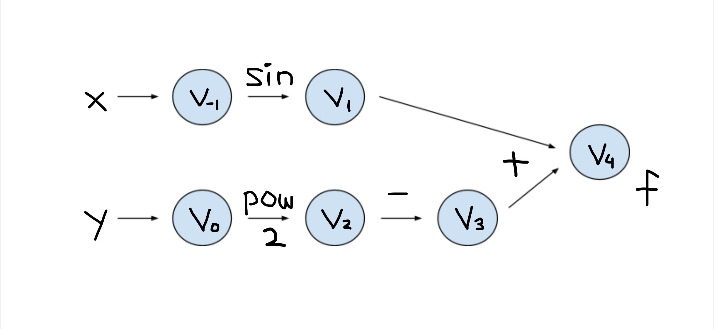

## Introduction
This is a package that offers the feature of automatic differentiation. 

Automatic differentiation is useful in many fields, including but not limit to:
- Calculation of derivatives when using some iterative methods to solve linear systems
- Calculation of the gradient of an objective function in optimization
- Calculation of derivatives/gradients which are parts of some numerical methods to solve differential equation systems

The functions and features in this package can evaluate derivatives of specified functions and free users from manual calculation.

## Background

For a function, even a complicated one, the computer is able to compute its derivatives by breaking it down into smaller parts, applying chain rule to the elementary operations, and calculate intermerdiate results at each step. 

In the graph structure of such calculation, each node is an intermediate result, and each arrow is an elementary operation. An elementary operation are such as addition, subtraction, multiplication, division, or taking exponential, log, sine, cosine, etc. An example is provided below.

## How to use

## Software Organizatoin

## Implementation

## License

