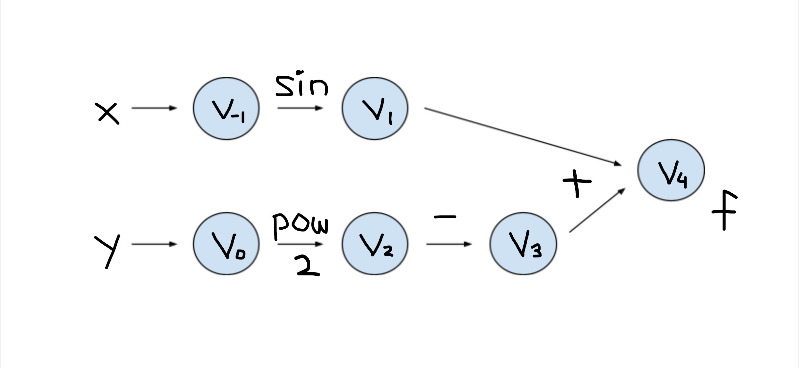
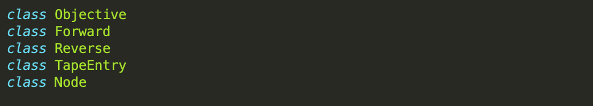
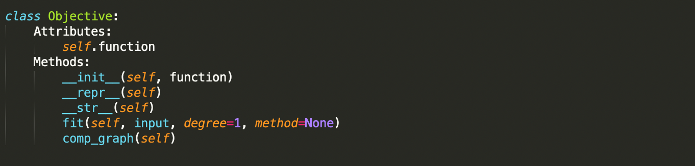
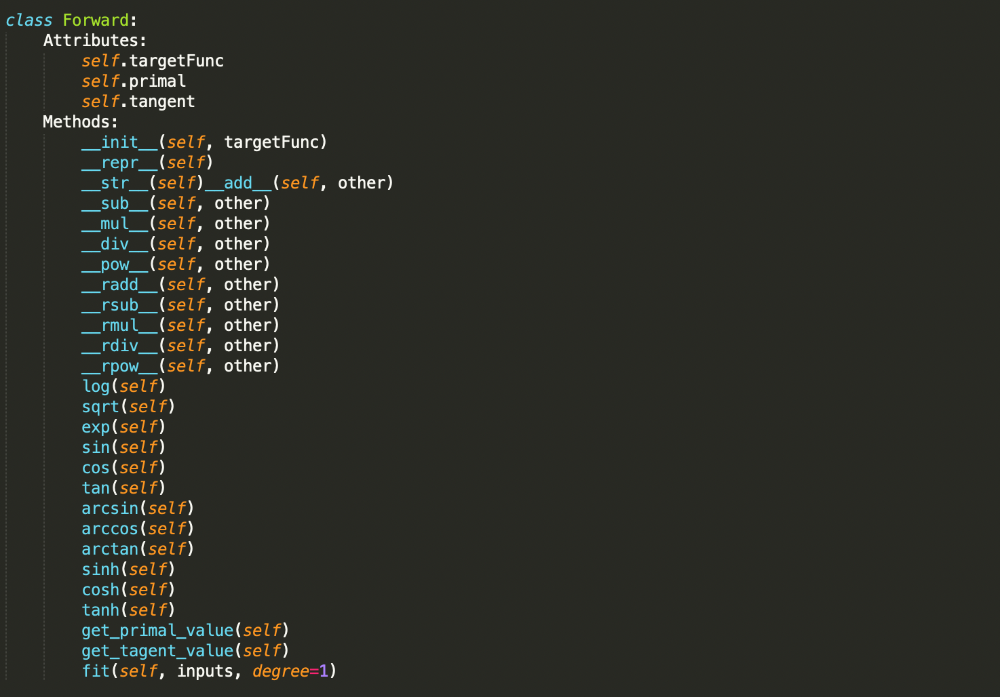
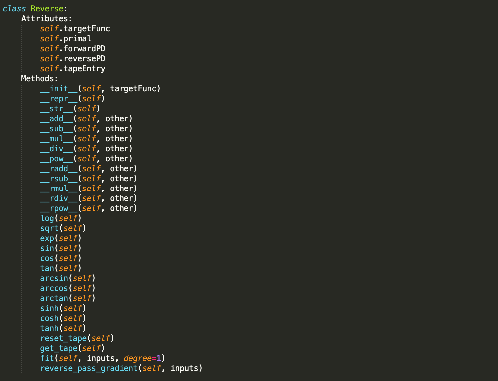
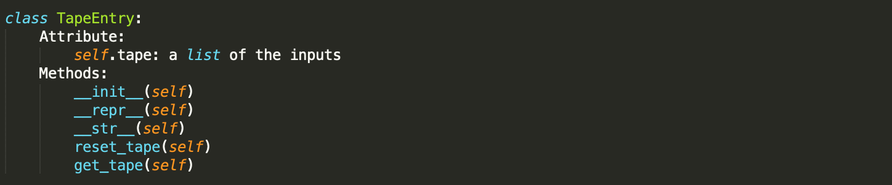
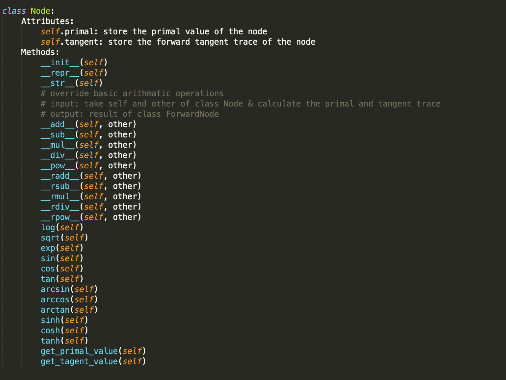

## Introduction
This is a package that offers the feature of automatic differentiation. 

Automatic differentiation is useful in many fields, including but not limit to:
- Calculation of derivatives when using some iterative methods to solve linear systems
- Calculation of the gradient of an objective function in optimization
- Calculation of derivatives/gradients which are parts of some numerical methods to solve differential equation systems

Automatic differentiation is better than other differencing methods like finite-difference because it is much cheaper. Finite differences are expensive, since you need to do a forward pass for
each derivative. Automatic differentiation is  both efficient (linear in the cost of computing the value) and numerically stable.

The functions and features in this package can evaluate derivatives/gradients of specified expressions and free users from manual calculation.


## Background

For a function, even a complicated one, the computer is able to compute its derivatives by breaking it down into smaller parts, applying chain rule to the elementary operations, and calculate intermerdiate results at each step. 

In the graph structure of such calculation, each node is an intermediate result, and each arrow is an elementary operation. An elementary operation are such as addition, subtraction, multiplication, division, or taking exponential, log, sine, cosine, etc. 

An example is provided below.

</a>

</a>




## How to use

### Installation

```
python -m pip install -i https://test.pypi.org/simple/cs107_ADpackage
```

You are recommended to use the package under Python version 3.6.2 or later. 

###  Demo

Import package

```python
import cs107_ADpackage as ad
```

Specify problem and draw the graph structure of the automatic differentiation

```python
f = np.sin(x) - y**2

func = ad.objective(function = f)
func.comp_graph()
```

Get the first derivatives of the function using forward propagation

```python
inputs = {x: 5, y: 6}
bw = forward(targetFunc=func)
drvt = bw.fit(degree=1, input=inputs)

print(drvt)
```


## Software Organizatoin

#### Directory Structure

```
cs107project/
    LICENSE
    README.md
    src/
        cs107_ADpackage
    docs/
    tests/
        test.py
    .travis.yml
 ```   

#### Included Modules and their Basic Functionality

We plan on using NumPy, Matplotlib, PyTest and PyTorch. We intend to use NumPy to create matrices and perform elementary calculations, Matplotlib to properly portray graphical structures of functions consisting of elementray operations, PyTest to run tests on our new code, and PyTorch to perform benchmarks on these tests.

#### Test Suite

Our test suite will live a test file /tests directory and it will be tested by TravisCI.

#### Package Distribution

We will distribute our package by uploading it to PyPI so everyone can use it.

#### Notes

We will not be packing out software. The code will be on GitHub and PyPI so it will be accessible by everyone.

As of right now we are still working on this project, so we could potentially make changes to the software later.


## Implementation

#### Core Data Structures

1. Nodes comprising variables and elementary operations, with basic operators overridden
2. Target objective function comprising nodes
3. Forward mode AD structure containing a target objective function and forward-mode-specific attributes
4. Reverse mode AD structure containing a target objective function and reverse-mode-specific attributes

#### Classes



The most generic base class will be the `Node` class to accomodate for the different nodes in the AD structure. Each node class will then be extended to create more specific nodes, such as a node representing an operator or input literal, along with another node type representing a variable. We will override the basic operators and elementary fucntions in this class.

We will then have a `Objective` class that is a collection of these nodes and the edges between them that encapsulates the operations.

We will also have two other classes, `Forward` for forward mode AD and `Reverse` for backward mode AD. 

#### Methods and Name Attributes



The `Objective` class will store the expression of the target objective function in `function`, and the nodes composing it in `Node`. It will have a method `comp_graph()`  to draw the graph structure of the automatic differentiation for the specified function. 



A `Forward` instance will store a function and its nodes (together of the `Objective` class type) in `targetFunc` and the expressions of the forward tangent trace in `trace`. It will have a method `fit()` that is able to calculate the gradients using forward mode AD based on input. 



A `Reverse` instance will store a function and its nodes (together of the `Objective` class type) in `targetFunc`, the structure of the function in tapeEntry (of the `tapeEntry` class type), the expressions of forward partial derivatives in `forwardPD`, and the expressions of reverse partial derivatives in `reversePD`. It will have a method `fit()` that is able to calculate the gradients using reverse mode AD based on input. 



A `tapeEntry` instance will store the graphical structure of each node. It will have a `get_tape` method which will return the node's children as a list. It will also have a `reset_tape` method to reset the history once a node is evaluated. This will be used for reverse mode automatic differentiation.



A `Node` instance will store the variables in the graph as nodes. Each node will have `primal` and `tangent` as their attribute to store the primal and tangent trace. It will have basic arithmatic operations such as `sin`, `cos`, and `add`, `sub` with overridden methods for dual numbers. 

#### External Dependencies

We will rely on the latest version of numpy. Other required dependencies will be the latest version of matplotlib, to be used specifically for outputting the visual representation of our data structures.

#### How will we deal with elementary functions?

Most elementary functions can be obtained from the numpy dependency. For more niche arithmetic functions that are not included in the package (or have definitions that are different from the standard implementations), we will likely overload with our home-grown implementations.


## License

The license that we decided to choose is the MIT License. We chose this license because our research showed that this license is usually the one that developers choose if they want their software to be easily accessible and quickly distributed to other developers and others in the community. We ultimately settled for this license because we believe in allowing other developers to freely use the software written for their desired purposes.

## Feedback

Introduction 1.5/2
It would be better if you illustrate more about the advantages of automatic differentiation over other differencing methods like finite-difference. 

Background 1.5/2 
I like the plot of computational graph you use to illustrate the computational process! It would be better if you illustrate more about how derivatives are computed during the process. 

How to Use 3/3 
Good job! It would be amazing if you succeed in implementing drawing the graph structure of the automatic differentiation. 

Software Organization 2/2 
You may want to mention Codecov as well for the test coverage of your code as well. 

Implementations 3.5/4 
It seems that you are dealing with a lot of classes, which might be problematic in implmentation. Also you may want to illustrate more about how you deal with vector functions of vectors and scalar function of vectors. 

License 2/2 
Great Discussion! 

Total 13.5/15

## Milestone 1

For the introduction, we were told to write about the advantages of automatic differentiation over other differencing methods like finite-difference. To address this comment, we added more about automatic differentiation and its advantages versus other differencing methods. 
