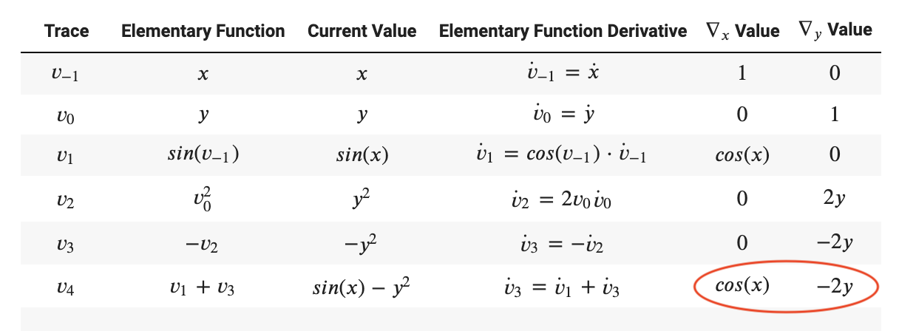

## Introduction
This is a package that offers the feature of automatic differentiation. 

Automatic differentiation is useful in many fields, including but not limit to:
- Calculation of derivatives when using some iterative methods to solve linear systems
- Calculation of the gradient of an objective function in optimization
- Calculation of derivatives/gradients which are parts of some numerical methods to solve differential equation systems

Automatic differentiation is better than other differencing methods like finite-difference because it is much cheaper. Finite differences are expensive, since you need to do a forward pass for
each derivative. Automatic differentiation is both efficient (linear in the cost of computing the value) and numerically stable. Traditional methods of differentiation such as symbolic differentiation do not scale well to vector functions with multiple variable inputs, which are widely used to solve real world problems.

The functions and features in this package can evaluate derivatives/gradients of specified expressions and free users from manual calculation.


## Background

For a function, even a complicated one, the computer is able to compute its derivatives by breaking it down into smaller parts, applying chain rule to the elementary operations, and calculate intermerdiate results at each step. 

In the graph structure of such calculation, each node is an intermediate result, and each arrow is an elementary operation. An elementary operation are such as addition, subtraction, multiplication, division, or taking exponential, log, sine, cosine, etc. In short, AD represent a function as a composition of elementary functions through elemtary operations by a sequence of intermediate values.

An example is provided below.

</a>

</a>


There are two modes of Automatic Differentiation: one is Forward Mode, and the other is Reverse Mode.

In forward mode, AD starts from the inputs and work towards the outputs, evaluating the value of each intermediate value along with its derivative with respect to a fixed input variable using the chain rule.

</a>

In the example above, a trace table for forward AD would look like the following to compute and store intermediate values and derivatives: 



In reverse mode, AD starts from the inputs to do a forward pass to calculate all the intermediate values, and then starts from the outputs to do a reverse pass to compute the derivatives of the function with respect to the intermediate values backwards using the chain rule.

</a>

In the example above, a trace table for reverse AD would look like the following to compute and store intermediate values and derivatives:  


## How to use

### Installation

```
python -m pip install -i https://test.pypi.org/simple/cs107_ADpackage
```

You are recommended to use the package under Python version 3.6.2 or later. 

###  Demo

Import package

```python
import cs107_ADpackage as ad
```

Specify problem and draw the graph structure of the automatic differentiation

```python
f = np.sin(x) - y**2

func = ad.objective(function = f)
func.comp_graph()
```

Get the first derivatives of the function using forward propagation

```python
inputs = {x: 5, y: 6}
bw = forward(targetFunc=func)
drvt = bw.fit(degree=1, input=inputs)

print(drvt)
```


## Software Organizatoin

#### Directory Structure

```
cs107project/
    LICENSE
    README.md
    src/
        cs107_ADpackage
    docs/
    tests/
        test.py
    .travis.yml
 ```   

#### Included Modules and their Basic Functionality

We plan on using NumPy, Matplotlib, PyTest and PyTorch. We intend to use NumPy to create matrices and perform elementary calculations, Matplotlib to properly portray graphical structures of functions consisting of elementray operations, PyTest to run tests on our new code, and PyTorch to perform benchmarks on these tests.

#### Test Suite

Our test suite will live a test file /tests directory and it will be tested by TravisCI.

#### Package Distribution

We will distribute our package by uploading it to PyPI so everyone can use it.

#### Notes

We will not be packing out software. The code will be on GitHub and PyPI so it will be accessible by everyone.

As of right now we are still working on this project, so we could potentially make changes to the software later.


## Implementation

#### Core Data Structures

1. Nodes comprising variables and elementary operations, with basic operators overridden
2. Target objective function comprising nodes
3. Forward mode AD structure containing a target objective function and forward-mode-specific attributes
4. Reverse mode AD structure containing a target objective function and reverse-mode-specific attributes

#### Classes

Our implementation will use 3 classes:

- Objective class: contains the objective functions, can also directly fit input data and calculate derivative using either forward or reverse mode depending on the paramter chosen
- Forward class: perform forward mode automatic differentiation on target function, evaluated with input value
- Reverse class: perform reverse mode automatic differentiation on target function, evaluated with input value

#### Methods and Name Attributes

##### Objective class

The `Objective` class will store the expression of the target objective function in `function`.

- `comp_graph()`: draw the graph structure of the automatic differentiation for the specified function. 
- `fit()`: allow user to fit input values directly to the objective function. If an method is specified, it will be applied. If no automatic differentiation methods is provided, then the optimial mode for the given function will be decided and applied. For instance, for a function with input dimension R ^ n and output dimension R ^ m:
	- If n < m, reverse mode AD will be use
	- If n > m, reverse mode AD will be uses


##### Forward class

A `Forward` instance will store a function in `targetFunc` and the expressions of the forward tangent trace in `primal` and `tangent`. 

- `fit()`: that is able to calculate the gradients using forward mode AD based on input, if no degree is specified, first derivative will be calculated.
- Overload basic operations: basic operation such as `__add__`, `__sub__` will be overload to support either dual numbers operation or dual number and scaler operation. It will also be implemented to support both scaler and vector input.
- Overload elementary operations: elementary operation such as `sin`, `cos` will also be overload to support either dual numbers operation or dual number and scaler operation. It will also be implemented to support both scaler and vector input.

 

##### Reverse Class

A `Reverse` instance will store a function in `targetFunc` and the structure of the function in `tapeEntry` , the expressions of forward partial derivatives in `forwardPD`, and the expressions of reverse partial derivatives in `reversePD`. 

- `fit()`: that is able to calculate the gradients using reverse mode AD based on input, if no degree is specified, first derivative will be calculated.
- `reverse_pass_gradient`: calculate reverse pass the derivative recursively base on the graph structure stored in `tapeEntry`.
- Overload basic operations: basic operation such as `__add__`, `__sub__` will be overload to support either dual numbers operation or dual number and scaler operation. It will also be implemented to support both scaler and vector input.
- Overload elementary operations: elementary operation such as `sin`, `cos` will also be overload to support either dual numbers operation or dual number and scaler operation. It will also be implemented to support both scaler and vector input.


#### External Dependencies

We will rely on the latest version of numpy. Other required dependencies will be the latest version of matplotlib, to be used specifically for outputting the visual representation of our data structures.

#### How will we deal with elementary functions?

Most elementary functions can be obtained from the numpy dependency. For more niche arithmetic functions that are not included in the package (or have definitions that are different from the standard implementations), we will likely overload with our home-grown implementations.


## License

The license that we decided to choose is the MIT License. We chose this license because our research showed that this license is usually the one that developers choose if they want their software to be easily accessible and quickly distributed to other developers and others in the community. We ultimately settled for this license because we believe in allowing other developers to freely use the software written for their desired purposes.

## Feedback

### Milestone 1 (Total 13.5/15)

#### Introduction 1.5/2
Comments: It would be better if you illustrate more about the advantages of automatic differentiation over other differencing methods like finite-difference. 

Resposne: For the introduction, we were told to write about the advantages of automatic differentiation over other differencing methods like finite-difference. To address this comment, we add more about automatic differentiation and its advantages versus other differencing methods. 

#### Background 1.5/2 
Comments: I like the plot of computational graph you use to illustrate the computational process! It would be better if you illustrate more about how derivatives are computed during the process. 

Response: For the background, we were asked to add more details about how derivatives are calculated. To address this comment, we add paragraphs explaining how the two different modes of AD, forward mode and reverse mode, compute the intermediate values and intermediate derivatives, and also write out the mathematical formulae for such computations for the two modes respectively. We also include the trace tables for each of the two modes for an easier understanding of how intermediate values and derivatives are calculated in an example.

#### How to Use 3/3 
Comments: Good job! It would be amazing if you succeed in implementing drawing the graph structure of the automatic differentiation. 

#### Software Organization 2/2 
Comments: You may want to mention Codecov as well for the test coverage of your code as well. 

#### Implementations 3.5/4 
Comments: It seems that you are dealing with a lot of classes, which might be problematic in implmentation. Also you may want to illustrate more about how you deal with vector functions of vectors and scalar function of vectors. 

Response: We decided to reduce our class type to Objective, Forward and Reverse to make the implementation process easier. We will implement the attributes and overload the basic operation (`__add__`, `__sub__`, etc) and elementary operation (`sin`, `cos`, etc) functions in the previous `Node` class inside `Forward` and `Reverse` class now. We will also replace the `TapeEntry` class and simply create a `tapeEntry` variable with `get_tape()` and `reset_tape()` functions in the Reverse class to keep track of the graphical structure and dependency of node. 

To deal with vector functions of vectors and scalar functions of vector, we will first check for the input functions type as vector or scaler in our when initializing the `Objective`, `Forward` or `Reverse` class, the input function will be stored as an attribute, and if multiple functions are input, the the `fit()` function will be execute on each of the function. 

We will also check the input data type for the function variable as either scaler or vector. The overloaded functions will contain methods to execute the respective operation for both scaler and vector input.  

#### License 2/2 
Comments: Great Discussion! 
